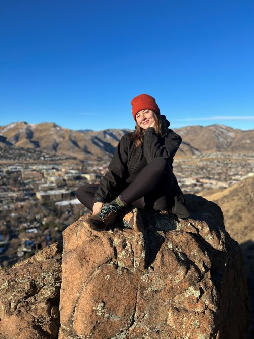

# 
Tesia Mancosky 

### 
 ESIIL Stars Profile 

I am a <a href="[https://esiil.org/esiil-stars]" target="_blank"> **2024 ESIIL Stars** intern. 

## 
Education and Professional Background

I am currently a senior in the Applied Geology program at Metropolitan State University of Denver. Before starting this program, I attended Boston College and received a B.A. in International Studies with a regional focus on Latin America and indigenous Latin American politics. I spent some time in Ecuador and Nicaragua working in refugee resettlement and service provision before moving to Washington, DC in 2015. Though I moved there with every intention of pursuing policy work, I fell in love with the service industry and spent five years working in some of the best restaurants and bars in the city. The onset of the COVID 19 pandemic reshaped my life in profound ways, namely in my relocation back to my hometown of Denver, CO in 2020. I started coursework in geology and environmental science at MSU after several revelatory experiences in the canyons and river valleys of the Western Slope of Colorado. 

## 
Research and Academic Pursuits

### Ongoing
I am currently conducting research on the carbonic springs in Manitou Springs, CO. Using published data from the Manitou Springs Foundation and Colorado Geologic Survey along with my own data collection, I am examining the influence of local structural geology on the hydrogeochemistry of the seven public mineral springs in Manitou. 

### Previous Work
As an undergraduate student at Boston College, my thesis research was centered on the shortcomings of international refugee law in the 21st century using the Latin American child migrant crisis of 2014 as a case study.

## 
About Me

 When I am not dedicating all of my energy to my school work, I occupy my time bartending, cycling, climbing in Clear Creek Canyon, cooking elaborate meals for friends, and reading at home. Though I have not had an opportunity to travel much the last few years, I relish the opportunity to spend any time in Central and South America. I hope that my professional ventures will allow me to work and live there again someday!

#### Contact Information

  * <a href="mailto: tmancosk@msudenver.edu" target="_blank">**Email**
  * <a href="https://tes-ani.github.io/" target="_blank">**Website**
 

